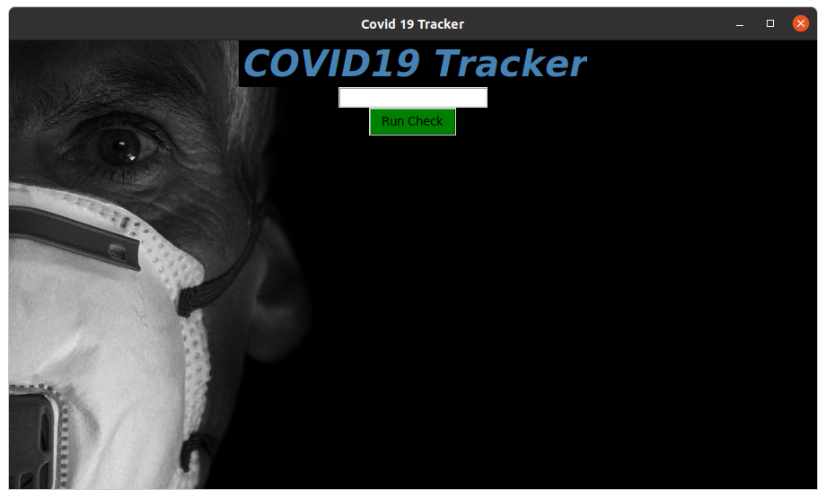

# COVID19-tracker

This micro-project aims to provide Real Time data of the COVID19 cases in each country.

## Motivation : 

Initially a basic web-scrapping project for extracting data of the COVID cases,later we decided to make the data accessible in the layman way.A great deal of focus goes into implementing our task effeciently with minimum dependencies and wihtout consuming much resources.

## Langauge Used : Python

## Prerequisits :

Python 3.x and Python IDLE/Shell 

## Libraries Used :

Regex<br/>
Requests<br/>
Pillows<br/>
Tinkter<br/>
Make sure the the required Libraries are installed correctly.

## Installation :
1. Clone the repository to your local machine.
2. Open the folder of the cloned repository.
3. Open the CommandLine from that folder.
and then type 
```
python3 COVID19-tracker.py
```
if you are using Linux,<br/>
if you are using Windows try,

```
python COVID19-tracker.py
```
4.The opening window should look like this.
<a name="Instance1"/>
<div align="center">
</img>
</div>
<br/>
5.Type in the Country Name you wan to search for.For eg:India or USA<br/>
6.The created report will look like this:
<a name="Instance2"/>
<div align="center">
</img>
</div>
<br/>

## DataBase : 

The application get's it's information from this [database](https://www.worldometers.info/coronavirus)


## License :

This project is under the MIT License.
